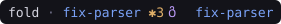

# fold-statusline

The **Fold deck line** — a boxed, icon-rich status line for [Claude Code](https://claude.com/claude-code), in the visual language of the [Fold](https://github.com/SamiAbi/fold) terminal IDE.


One line inside a rounded frame. The rule *below* each row is a **caption rail** — it names every value sitting above it, so nothing is a bare number you have to remember the meaning of. It costs no width at all: the captions live in the rule the box was already drawing.

When your pane gets narrow, the line doesn't truncate or shrink — it **folds** the same content onto two, then three balanced rows, like paper, and each row's captions ride the rule directly beneath it:


## Install

```sh
npx github:SamiAbi/fold-statusline
```

or clone and run `node bin/cli.mjs install`. The CLI copies `statusline.mjs` to `~/.claude/`, enables it in `~/.claude/settings.json`, and backs up whatever status line you had before — `fold-statusline uninstall` restores it exactly.

**Two icon sets, picked by where you are.** Inside [Fold](https://github.com/SamiAbi/fold), the status line uses **Fold Icons** — the design system's folded-glyph set, shipped inside the Fold app itself; there is nothing to install. Everywhere else it falls back to Nerd Font glyphs automatically, which is what the Maple Mono NF install is for: `install` gets [Maple Mono NF](https://github.com/subframe7536/maple-font) when no Nerd Font is found (Homebrew when available, direct download otherwise). `FOLD_STATUSLINE_ICONS=fold` or `=nerd` overrides the detection.

**Requirements:** Claude Code · Node ≥ 18 · a truecolor terminal.

```sh
fold-statusline status      # is it installed + enabled? fonts present?
fold-statusline font        # just the fonts: install + enable instructions
fold-statusline uninstall   # put everything back the way it was
```

## Anatomy — every section, left to right

### The title: where you are

| | Meaning |
|---|---|
|  | The **repo name** (or folder name outside git), the current **branch** in Fold's accent blue — accent always means *location* — and the **dirty count** (changed files in the working tree; hidden when clean) |
|  | In a **git worktree**, the branch-off glyph and the worktree's own directory name follow the dirty count — and the repo name stays the *main* repo's, so the project never appears to rename itself when you switch worktrees. Hidden when you're in a normal checkout |

### The row: who, what, and how much is left

Each section's caption appears on the rule below it — `account`, `model · effort`, `output style`, `context used · left`, `5h · resets`, `7d · resets`, `mcp`, `session` — so `41%` is unmistakably the five-hour window and `23:53` is unmistakably when it resets.

| Section | Meaning |
|---|---|
|  | The Claude **account** signed in (email local part) |
|  | **Model** and **reasoning effort** — the bolt is dim / green / amber / red for low / medium / high / max, and `FAST` appears bold red in fast mode |
|  | The active **output style** (`/output-style`) — how Claude writes; `default` renders dim so the usual state stays quiet |
|  | **Context window**: 10-cell bar + percent used, then **time-to-empty** predicted from your live burn rate (token samples across renders). Before enough samples exist it shows tokens left (`165k`) |
|  | …and at ≥ 80 % the whole section turns red, with a fire and the shrinking estimate |
|  | The rolling **5-hour rate-limit window**: percent used and — instead of a countdown you'd have to do math on — the **wall-clock time it resets** |
|  | The **7-day window**, same treatment; beyond 24 h the reset shows as a weekday |
|  | **MCP servers** connected (cached, refreshed every 2 min in the background) |
|  | …and if a server that was up goes down, the count turns red |
|  | How long this Claude Code **session** has been running |
|  | **Enterprise seats only**: running cost replaces the 5-hour slot (those seats have no 5h window). With `CLAUDE_COST_BUDGET=25` set it becomes a budget bar |

**Color rules** (Fold's design system): captions on the rail are dim, one step above the rule they sit in — they label, they don't compete; icons wear one muted grey, so color only ever means something — meters are green under 50 %, amber to 80 %, red above (and a hot meter turns its icon red too); the empty bar track and separators stay quiet; **bold** marks only the numbers your eye should land on; the accent blue is reserved for *where you are*.

### States you'll see

- **Fresh session** — sections whose data hasn't arrived yet hold their slot with a dim `—`, so the layout never jumps when numbers land.
- **Narrow panes** — the line measures your terminal (`stty size` against the controlling tty) and re-lays the same sections onto 2 or 3 balanced, edge-justified rows divided by `├───┤` rules, each of which becomes that row's caption rail. Nothing is ever dropped or abbreviated; when the width can't be detected it assumes wide.
- **Rules too narrow for their captions** — the whole row's captions drop to a short form (`5h · resets` becomes `5h`), and only if even those won't fit does the rule go back to plain dashes. A caption never overlaps another or spills past the corner.

## How it works

A single dependency-free Node script that Claude Code invokes with its status JSON on stdin. Captions are placed by block relaxation: each wants to be centred on its own section, and any that would collide merge into a block that slides as one to the position of least total displacement — so slack anywhere along the rule gets shared out rather than shunting every later caption rightwards. It adds: a per-session cache so values never flicker between renders, account-wide reuse of rate-limit data (a brand-new session shows your windows immediately), burn-rate sampling for the time-to-empty estimate, and a detached, throttled `claude mcp list` refresh so the MCP count never slows a render.

## Design

The palette and grammar come from Fold's design system (Tokyo-Night-adjacent): `#7aa2f7` accent for location, `#9ece6a` / `#e0af68` / `#f7768e` meter thresholds, and every icon in one muted grey (`#8b8b9f`, the glyph-grid treatment) — color on an icon is reserved for state: danger red when a meter runs hot or an MCP server drops, and the bolt's effort scale. The deck line was chosen from a 25-design exploration; the full spec lives with the Fold project.

### The icon font

The glyphs are the **folded-glyph set** from Fold's design system (`icons/statusline.html` there): the lit face above the diagonal fold line full-strength, the shadow face ghosted below — the logo's one-light-source facets carried into 24 px icons. [`font/design-icons.mjs`](font/design-icons.mjs) holds the design file's SVG fragments verbatim; [`font/glyphs.mjs`](font/glyphs.mjs) turns them into font outlines through a small geometry kit ([`font/lib/geo.mjs`](font/lib/geo.mjs): an SVG path parser that samples curves into polygons, a containment-depth winding fixer so evenodd artwork renders correctly under the font's nonzero rule, and half-plane clipping for the crease). Three glyphs are drawn here in the same language: `cost` (the design writes it as live text, `$`), `wtree` (not in the set yet), and the brand `mark` from `brand/logo.html`.

In the terminal the glyphs are plain outlines, tinted by ANSI color like any text, with the crease rendered as a thin slit through each form — invisible weight at cell sizes, clearly a fold at display sizes. The font also carries **COLR layers** (the true two-tone, lit face over a 50% ghost) which Chromium-based surfaces such as these README previews render; native terminal rasterizers ignore them and draw the outline. A full color-bitmap pipeline (sbix strikes, state-colored variant codepoints at `U+E90E–E913`) lives in `font/render-strikes.mjs` + `font/rasterize-strikes.py`, currently unused — Ghostty's bitmap sizing proved too erratic to ship.

`npm run build:font` builds the font (`build.mjs` outlines → `colorize.py` COLR layers for the README's previews); `npm run deploy:font` copies the result into the Fold repo (`Sources/Fold/Resources/`), which is the only place the TTF lives — it is not committed or shipped here. The design assigns these icons `U+F8010–F801C` in Fold's flight-glyph font; fold-statusline ships the same artwork at its own BMP range `U+E900–E913`, where terminal width handling is reliable. Codepoints are frozen — appending is fine, reordering is a breaking change.

## License

MIT
