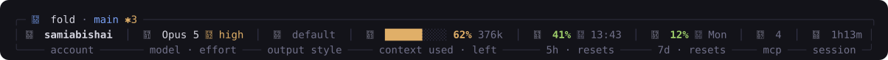
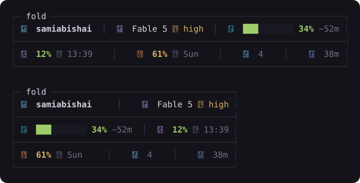
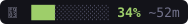
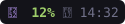
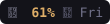
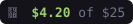

# fold-statusline

The **Fold deck line** — a boxed, icon-rich status line for [Claude Code](https://claude.com/claude-code), in the visual language of the [Fold](https://github.com/SamiAbi/fold) terminal IDE.



One line inside a rounded frame. When your pane gets narrow, it doesn't truncate or shrink — it **folds** the same content onto two, then three balanced rows, like paper:



## Install

```sh
npx github:SamiAbi/fold-statusline
```

or clone and run `node bin/cli.mjs install`. The CLI copies `statusline.mjs` to `~/.claude/`, enables it in `~/.claude/settings.json`, and backs up whatever status line you had before — `fold-statusline uninstall` restores it exactly.

**The icons need a Nerd Font.** If none is found, `install` gets [Maple Mono NF](https://github.com/subframe7536/maple-font) for you (Homebrew when available, direct download to your user fonts otherwise) and then tells you exactly where to select it in *your* terminal (Terminal.app, iTerm2, VS Code, WezTerm — and for Ghostty it writes the `font-family` line into the config itself). Selecting the font is the one step no CLI can do for every terminal — it's a per-app setting.

**Requirements:** Claude Code · Node ≥ 18 · a truecolor terminal.

```sh
fold-statusline status      # is it installed + enabled? font present?
fold-statusline font        # just the font install + enable instructions
fold-statusline uninstall   # put everything back the way it was
```

## Anatomy — every section, left to right

### The title: where you are

| | Meaning |
|---|---|
|  | The paper plane, the **repo name** (or folder name outside git), the current **branch** in Fold's accent blue — accent always means *location* — and the **dirty count** (changed files in the working tree; hidden when clean) |

### The row: who, what, and how much is left

| Section | Meaning |
|---|---|
|  | The Claude **account** signed in (email local part) |
|  | **Model** and **reasoning effort** — the bolt is dim / green / amber / red for low / medium / high / max, and `FAST` appears bold red in fast mode |
|  | The active **output style** (`/output-style`) — how Claude writes; `default` renders dim so the usual state stays quiet |
|  | **Context window**: 10-cell bar + percent used, then **time-to-empty** predicted from your live burn rate (token samples across renders). Before enough samples exist it shows tokens left (`165k`) |
|  | …and at ≥ 80 % the whole section turns red, with a fire and the shrinking estimate |
|  | The rolling **5-hour rate-limit window**: percent used and — instead of a countdown you'd have to do math on — the **wall-clock time it resets** |
|  | **Extra-usage credits**: dollars left on your credit balance. Appears only when there is money to show — no credits, $0, or unknown means the section vanishes. A dim age tag like `(16d)` marks a reading Claude Code hasn't refreshed lately |
|  | The **7-day window**, same treatment; beyond 24 h the reset shows as a weekday |
|  | **MCP servers** connected (cached, refreshed every 2 min in the background) |
|  | …and if a server that was up goes down, the count turns red |
|  | How long this Claude Code **session** has been running |
|  | **Enterprise seats only**: running cost replaces the 5-hour slot (those seats have no 5h window). With `CLAUDE_COST_BUDGET=25` set it becomes a budget bar |

**Color rules** (Fold's design system): meters are green under 50 %, amber to 80 %, red above; the empty bar track and separators stay quiet; **bold** marks only the numbers your eye should land on; the accent blue is reserved for *where you are*.

### States you'll see

- **Fresh session** — sections whose data hasn't arrived yet hold their slot with a dim `—`, so the layout never jumps when numbers land.
- **Narrow panes** — the line measures your terminal (`stty size` against the controlling tty) and re-lays the same sections onto 2 or 3 balanced, edge-justified rows divided by `├───┤` rules. Nothing is ever dropped or abbreviated; when the width can't be detected it assumes wide.

## How it works

A single dependency-free Node script that Claude Code invokes with its status JSON on stdin. It adds: a per-session cache so values never flicker between renders, account-wide reuse of rate-limit data (a brand-new session shows your windows immediately), burn-rate sampling for the time-to-empty estimate, and a detached, throttled `claude mcp list` refresh so the MCP count never slows a render.

## Design

The palette and grammar come from Fold's design system (Tokyo-Night-adjacent): `#7aa2f7` accent for location, `#9ece6a` / `#e0af68` / `#f7768e` meter thresholds, and the editor's cyan/purple/orange/teal as icon keys. The deck line was chosen from a 25-design exploration; the full spec lives with the Fold project.

## License

MIT
