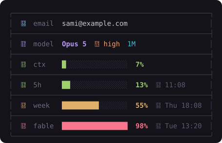

# fold-statusline

The **Fold status line** for [Claude Code](https://claude.com/claude-code) — six facts in one framed table, in the visual language of the [Fold](https://github.com/SamiAbi/fold) terminal IDE.


Who you are and what you're running on the left; the three limits that decide how long you can keep going on the right. Nothing else — no clock, no cost, no MCP count, no git (the terminal already tells you those).

## Install

```sh
npx github:SamiAbi/fold-statusline
```

or clone and run `node bin/cli.mjs install`. The CLI copies `statusline.mjs` to `~/.claude/`, enables it in `~/.claude/settings.json`, and backs up whatever status line you had before — `fold-statusline uninstall` restores it exactly.

**Two icon sets, picked by where you are.** Inside [Fold](https://github.com/SamiAbi/fold), the status line uses **Fold Icons** — the design system's folded-glyph set, shipped inside the Fold app itself; there is nothing to install. Everywhere else it falls back to Nerd Font glyphs automatically, which is what the Maple Mono NF install is for: `install` gets [Maple Mono NF](https://github.com/subframe7536/maple-font) when no Nerd Font is found (Homebrew when available, direct download otherwise). `STATUS_ICONS=fold` or `=nerd` overrides the detection.

**Requirements:** Claude Code · Node ≥ 18 · a truecolor terminal. The **fable** row (and the instant 5h / week numbers on a fresh session) needs the Claude Code login token — read from the macOS login keychain, or from `~/.claude/.credentials.json` elsewhere. Without it the row shows a dim `—` and everything else still works.

```sh
fold-statusline status      # is it installed + enabled? fonts present?
fold-statusline font        # just the fonts: install + enable instructions
fold-statusline uninstall   # put everything back the way it was
```

## The six rows

| Row | What it says | Where it comes from |
|---|---|---|
| **email** | The Claude account signed in | `~/.claude.json` |
| **model** | Model name, the **effort** level with its bolt (Fold draws the bolt at four heights, low → max), and a **1M** badge when the 1M-context model is on. `(1M context)` is stripped from the name so the fact is stated once | the status payload |
| **ctx** | Context window used: a 16-cell bar and the percent. At ≥ 80 % the row turns red and the database becomes a fire | the status payload |
| **5h** | The rolling 5-hour rate-limit window, plus the **wall-clock time it resets** — no countdown math | the status payload, live |
| **week** | The 7-day window, same treatment; beyond today the reset shows its weekday | the status payload, live |
| **fable** | The 7-day window scoped to the **Fable** model — the payload doesn't carry per-model limits, so this comes from the usage API | `api.anthropic.com/api/oauth/usage` |

**Colour rules** (Fold's design system): meters are green under 50 %, amber to 80 %, red above — and a hot meter tints its icon too. **Bold** marks only the numbers your eye should land on; labels, the empty bar track, reset clocks and the frame stay quiet. Email is cyan, model purple, effort orange, the 1M badge teal.

**Fresh sessions.** The payload has no context or rate-limit numbers until the session's first reply. The 5h and week rows fall back to the last usage-API reading so they show immediately; the live numbers win the moment they arrive. `ctx` genuinely isn't known yet and holds a dim `—` — reusing the previous session's number would be a lie.

**Never waits on the network.** The usage API is polled at most every two minutes, in a detached background process that writes `~/.claude/status-limits.json`. A render only ever reads that file.

## Knobs

Every knob is an environment variable, so nothing needs editing:

| Variable | Values | Default | |
|---|---|---|---|
| `STATUS_LAYOUT` | `2col` · `1col` | `2col` | two columns of three rows, or one stacked table (below) |
| `STATUS_BORDER` | `on` · `off` | `on` | the rounded frame. Borderless, Claude Code trims each line's leading spaces, so the right edge can go ragged |
| `STATUS_SEP` | `rule` · `blank` · `none` | `rule` | what stands between rows |
| `STATUS_ALIGN` | `left` · `grid` | `left` | `grid` right-aligns the percents so digits stack |
| `STATUS_BAR` | a number ≥ 4 | `16` | bar length in cells |
| `STATUS_ICONS` | `fold` · `nerd` | auto | force an icon set |



## How it works

A single dependency-free Node script that Claude Code invokes with its status JSON on stdin. Every row is the same grid — glyph, label, value, amount, when — with column widths computed per block, so the two columns never stretch each other; the email and model rows span the value columns and are kept out of the width maths. Widths are measured in code points with ANSI stripped, which is right because every Fold and Nerd glyph draws in exactly one cell.

One host detail worth knowing: Claude Code post-processes status-line output with `stdout.trim().split("\n").flatMap((l) => l.trim() || [])`, which deletes every whitespace-only line. The `blank` separator therefore uses U+2800 BRAILLE PATTERN BLANK, which draws as empty but survives the trim.

## Design

The palette comes from Fold's design system (Tokyo-Night-adjacent): `#9ece6a` / `#e0af68` / `#f7768e` meter thresholds, `#7dcfff` cyan for the account, `#bb9af7` purple for the model, `#ff9e64` orange for effort, `#2ac3de` teal for the 1M badge, and one muted grey for labels and the frame.

### The icon font

The glyphs are the **folded-glyph set** from Fold's design system (`icons/statusline.html` there): the lit face above the diagonal fold line full-strength, the shadow face ghosted below — the logo's one-light-source facets carried into 24 px icons. [`font/design-icons.mjs`](font/design-icons.mjs) holds the design file's SVG fragments verbatim; [`font/glyphs.mjs`](font/glyphs.mjs) turns them into font outlines through a small geometry kit ([`font/lib/geo.mjs`](font/lib/geo.mjs): an SVG path parser that samples curves into polygons, a containment-depth winding fixer so evenodd artwork renders correctly under the font's nonzero rule, and half-plane clipping for the crease).

The status line uses eleven of the twenty glyphs: `user` `chip` `db` `dbHot` `hour` `cal` `clock` and the four graded bolts `boltLow` … `boltMax` (U+E910–E913). The rest stay in the font for the other surfaces that share it.

In the terminal the glyphs are plain outlines, tinted by ANSI colour like any text, with the crease rendered as a thin slit through each form. The font also carries **COLR layers** (the true two-tone, lit face over a 50% ghost) which Chromium-based surfaces such as these README previews render; native terminal rasterizers ignore them and draw the outline.

`npm run build:font` builds the font (`build.mjs` outlines → `colorize.py` COLR layers for the README's previews); `npm run deploy:font` copies the result into the Fold repo (`Sources/Fold/Resources/`), which is the only place the TTF lives — it is not committed or shipped here. `node docs/render-svg.mjs` re-renders the README previews from the real script inside a scratch HOME. Codepoints (U+E900–E913) are frozen — appending is fine, reordering is a breaking change.

## License

MIT
